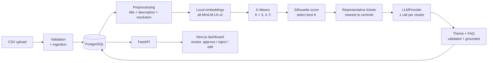

# Knowledge Base FAQ Auto Builder

Turns a dataset of resolved support tickets into a reviewable knowledge base: it finds recurring issue themes with an ML clustering pipeline, then asks an LLM to *write* one grounded FAQ per theme. Every FAQ links back to the tickets it was built from and must be approved by a human before it counts as knowledge-base content.

| Theme (example)        | Tickets | FAQ                                       |
| ---------------------- | ------: | ----------------------------------------- |
| Payment pending        |      44 | Why does my payment remain pending?       |
| Refund processing      |      22 | Why hasn't my refund been processed?      |
| Duplicate transactions |      25 | Why was I charged twice for one order?    |

## 1. Problem

Support teams solve the same problems repeatedly, but the answers stay buried in ticket resolutions. Writing FAQs by hand means reading hundreds of tickets, and asking an LLM "give me 5 FAQs" from a CSV is unreliable: the model chooses arbitrary groupings, cannot see everything, and may invent plausible-sounding fixes.

## 2. Solution

Separate *discovery* from *writing*:

- **Discovery is deterministic ML.** Tickets are embedded locally and clustered with K-Means. The number of clusters is chosen from the data by silhouette score, not hard-coded.
- **Writing is the LLM's only job.** For each cluster, Gemini receives the most representative tickets and their resolutions and drafts a theme and FAQ, under strict grounding rules.
- **Humans stay in the loop.** FAQs start as drafts (`GENERATED`) and only become knowledge-base content when approved.

## 3. Architecture



```
backend/app/
  api/          thin FastAPI routers + dependency wiring (no business logic)
  services/     ingestion, preprocessing, clustering, FAQ generation, pipeline, persistence queries
  embeddings/   EmbeddingProvider protocol, sentence-transformers impl, on-disk cache
  clustering/   Clusterer protocol, K-Means, silhouette evaluation, K selection, representatives
  llm/          LLMProvider protocol, GeminiProvider, MockLLMProvider
  prompts/      versioned FAQ prompt
  models/       SQLAlchemy tables      schemas/  Pydantic models
  database/     engine + session       core/     settings + typed errors
frontend/src/   app/ (pages)  components/  lib/ (typed API client)
```

## 4. Tech stack

- **Backend:** Python, FastAPI, SQLAlchemy 2, Pydantic 2, PostgreSQL
- **ML:** sentence-transformers (`all-MiniLM-L6-v2`), scikit-learn (K-Means, silhouette)
- **LLM:** Gemini 2.5 Flash behind an `LLMProvider` interface (plus an offline mock)
- **Frontend:** Next.js 14, React, TypeScript, Tailwind CSS, Recharts
- **Infra:** Docker, docker-compose. **Tests:** pytest

## 5. Data flow

1. `POST /api/tickets/upload` validates the CSV and stores new tickets. Bad rows are reported, not fatal.
2. `POST /api/clusters/generate` loads all tickets, embeds them, clusters, picks K, picks representatives, generates FAQs, and stores the result in one transaction (replacing the previous run).
3. The dashboard reads clusters, tickets and FAQs, and calls approve / reject / edit.

## 6. Clustering methodology

- **Text:** `title. description. resolution` per ticket. The resolution is included deliberately: tickets fixed the same way belong in one FAQ even when customers describe them differently.
- **Embeddings:** `all-MiniLM-L6-v2`, L2-normalised, cached on disk per text (key = hash of model + text).
- **Algorithm:** K-Means for K = 3, 4, 5 (`n_init=10`, fixed seed for reproducibility).
- **Selection:** the K with the highest silhouette score (cosine distance) wins; ties go to the smaller K. All scores are stored and shown in the UI.
- **Representatives:** the 5 tickets closest to each centroid (cosine similarity). These, not the whole cluster, are sent to the LLM.
- **Extensibility:** clustering sits behind a small `Clusterer` protocol, so HDBSCAN can be added without touching the pipeline. `Clusterer.fit(embeddings, n_clusters)` would need a variant for density-based methods that choose their own cluster count.

## 7. LLM usage

- One call **per cluster**, never per ticket: 5 clusters means about 5 calls.
- The LLM never discovers clusters. It receives ticket IDs, titles, descriptions and resolutions and returns JSON: `theme`, `description`, `question`, `answer`, `resolution_steps`, `source_ticket_ids` (plus an `insufficient_information` flag).
- `LLMProvider` is a two-method contract (`name`, `generate_json`). `GeminiProvider` and `MockLLMProvider` implement it; swapping vendors means adding one file.

## 8. Grounding strategy

1. **Prompt rules:** use only the provided tickets; no invented causes, steps or timings; every step must be supported by a resolution; if information is insufficient, say so and set `insufficient_information`.
2. **Schema validation:** output must match the `FaqDraft` model, or it is rejected.
3. **Source check in code:** every cited `source_ticket_id` must be one that was actually sent. A citation of an unknown ticket invalidates the output.
4. **Retry once** on invalid output; a provider failure (quota, network) is not retried and is recorded on the cluster instead.
5. **Human approval:** nothing is final until a reviewer approves it. Editing an approved FAQ returns it to `REVIEW`. Regenerating one (**Regenerate** button, with a confirmation if it was approved, edited or rejected) returns it to `GENERATED`.

Limits: steps 2–3 check structure and citations, not the *meaning* of the answer. The prompt rules and the reviewer cover that.

## 9. API

Interactive docs at `/docs` when the backend is running.

| Method | Path | Purpose |
| --- | --- | --- |
| POST | `/api/tickets/upload` | Upload a CSV (multipart field `file`). 400 malformed, 409 duplicate file, 422 empty |
| POST | `/api/clusters/generate` | Run the pipeline; returns run info, counts and step list. 422 if too few tickets, 502 on LLM/embedding failure |
| GET | `/api/clusters` | Latest run and its clusters (name, count, representatives, FAQ) |
| GET | `/api/clusters/{id}` | One cluster plus clustering info (chosen K, silhouette per K) |
| GET | `/api/clusters/{id}/tickets` | All source tickets in the cluster |
| GET | `/api/clusters/{id}/faq` | The cluster's FAQ (404 with reason if generation failed) |
| POST | `/api/clusters/{id}/faq/regenerate` | Replace the cluster's FAQ with a new one (skips the cache; the model sees the previous version). The FAQ keeps its id and returns to `GENERATED`. 502 with the reason if generation fails, in which case the existing FAQ is kept |
| PATCH | `/api/faqs/{id}` | Edit theme / description / question / answer / steps; status becomes `REVIEW` |
| POST | `/api/faqs/{id}/approve` | Status `APPROVED` |
| POST | `/api/faqs/{id}/reject` | Status `REJECTED` |
| GET | `/api/stats` | Dashboard numbers |
| GET | `/health` | Liveness |

FAQ statuses: `GENERATED` → `REVIEW` → `APPROVED` / `REJECTED`.

## 10. Local setup

### Option A: Docker (needs Docker Desktop / Compose v2)

```bash
cp .env.example .env        # optional: add GEMINI_API_KEY and set LLM_PROVIDER=gemini
docker compose up --build
```

Frontend: <http://localhost:3000> · API docs: <http://localhost:8000/docs>. If those ports are taken, set `BACKEND_PORT` / `FRONTEND_PORT` in `.env`. The first run downloads the embedding model (~90 MB) into a volume.

### Option B: run directly

Backend (Python 3.9+):

```bash
python -m venv backend/.venv
backend/.venv/Scripts/activate          # Windows;  source backend/.venv/bin/activate on macOS/Linux
pip install -r backend/requirements.txt  # on Python 3.9/Windows: pip install --only-binary=:all: greenlet first
cp .env.example .env
cd backend && uvicorn app.main:app --reload --port 8000
```

`DATABASE_URL` in `.env` points at PostgreSQL. If it is unset, the backend falls back to a local SQLite file (`faq_dev.db`), which is convenient for development.

Frontend (Node 18+):

```bash
cd frontend
npm install
echo NEXT_PUBLIC_API_URL=http://localhost:8000 > .env.local   # match your backend port
npm run dev
```

Then open <http://localhost:3000>, go to **Upload**, and choose `data/sample_tickets.csv`.

### Gemini

Set `GEMINI_API_KEY` and `LLM_PROVIDER=gemini` in `.env`. The default `mock` provider works offline and produces placeholder FAQs, useful for development. Responses are cached under `CACHE_DIR/llm`, so re-running on the same data makes no new API calls.

### Resetting the database

To start from a clean slate, stop the backend and empty every app table (the tables themselves are kept, and ID counters restart at 1). This cannot be undone: edited and approved FAQs are lost too.

With `psql` (installed with PostgreSQL). Use `127.0.0.1` rather than `localhost`: over IPv6 (`::1`) the password check can fail even when the password is correct.

```powershell
$env:PGPASSWORD = "faq"
& "C:\Program Files\PostgreSQL\16\bin\psql.exe" -h 127.0.0.1 -U faq -d faq -c "TRUNCATE faqs, cluster_tickets, clusters, cluster_runs, tickets, uploads RESTART IDENTITY CASCADE;"
```

Or without `psql`, from the project root using the project's Python:

```powershell
.venv\Scripts\python.exe -c "import psycopg2; c=psycopg2.connect('dbname=faq user=faq password=faq host=127.0.0.1'); c.cursor().execute('TRUNCATE faqs, cluster_tickets, clusters, cluster_runs, tickets, uploads RESTART IDENTITY CASCADE'); c.commit(); print('cleared')"
```

Gemini responses are cached separately under `CACHE_DIR/llm`, so after a reset a cluster with the same tickets reuses its old FAQ without a new API call. To force fresh FAQs, also delete that folder (`Remove-Item -Recurse -Force backend\.cache\llm`). Leave `.cache/embeddings` alone; it only speeds up clustering.

When using the SQLite fallback instead of PostgreSQL, stop the backend and delete `backend/faq_dev.db`; it is recreated on the next start.

Then restart the backend, upload `data/sample_tickets.csv` again and generate the clusters.

### Tests

```bash
cd backend && python -m pytest          # fast tests, no model download
python -m pytest -m slow                # also runs the real embedding model
```

### CLI demo (no server)

```bash
python backend/scripts/run_pipeline.py data/sample_tickets.csv --llm mock
```

## 11. Example output

Sample dataset: 153 synthetic tickets, 9 underlying issue types. Silhouette scores: K=3 → 0.169, K=4 → 0.145, K=5 → 0.174, so **K=5** was selected.

The cluster sizes, K scores and representative tickets below come from a real run. The FAQ wording is **illustrative**: it is what the pipeline is designed to produce, and the actual text depends on the LLM provider (the offline mock provider only echoes ticket text).

```
Cluster 2  (44 tickets)      Payment pending
  Representatives: T104, T088, T109, T069, T066
  FAQ:  Why does my payment remain pending?
  Steps: reconcile with the gateway report / replay the missed webhook / ...
  Sources: T104, T088, T109, T069, T066          Status: GENERATED
```

The sample data has 9 issue types but K is limited to 3–5, so one cluster mixes several unrelated topics. That is expected, and such clusters are where the grounding rules should produce a cautious answer or `insufficient_information`. Silhouette scores near 0.17 indicate loosely separated clusters.

## 12. Future improvements

- **HDBSCAN** (or other density-based clustering) so the number of themes emerges from the data, with noise tickets left unassigned.
- **Search K over a wider range** and add cluster-quality metrics (Davies-Bouldin, stability across seeds).
- **Background jobs** (Celery/RQ) with real progress streaming instead of one synchronous request.
- **Keep approval history across regenerations** (FAQ versioning, matching new clusters to approved ones). Today regenerating replaces the run and resets statuses.
- **Alembic migrations** instead of `create_all` at startup.
- **Authentication and roles** for reviewers; audit log of approvals.
- **Automatic grounding checks**, e.g. verify that each resolution step is semantically supported by a source resolution.
- Publish approved FAQs to a help center / export as Markdown.
